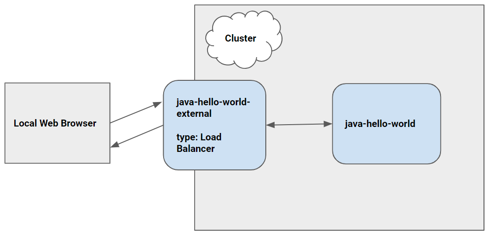

# Hello World with Cloud Code [](https://travis-ci.org/daggerok/idea-cloud-code-plugin-skaffold)



"Hello World" is a simple Kubernetes application that contains a single
[Deployment](https://kubernetes.io/docs/concepts/workloads/controllers/deployment/) and a corresponding
[Service](https://kubernetes.io/docs/concepts/services-networking/service/). The Deployment contains a
[Spring-based](http://spring.io/) web server that simply prints "Hello World".

----

## Table of Contents

### Cloud Code

1. [IDEA Getting Started](#idea-getting-started)
2. [Visual Studio Code Getting Started](#visual-studio-code-getting-started)
3. [What's in the box](https://cloud.google.com/code/docs/vscode/quickstart#whats_in_the_box)
4. Using Cloud Code
    * [Set up a Google Kubernetes Engine Cluster](https://cloud.google.com/code/docs/vscode/quickstart#creating_a_google_kubernetes_engine_cluster)
    * [Deploy the app](https://cloud.google.com/code/docs/vscode/quickstart#deploying_your_app)
    * [Continuous Deployment](https://cloud.google.com/code/docs/vscode/quickstart#initiating_continuous_deployment)
    * [View Container Logs](https://cloud.google.com/code/docs/vscode/quickstart#viewing_container_logs)
    * [Debug Your Code](https://cloud.google.com/code/docs/vscode/quickstart#debugging_your_application)
    * [Open a Terminal in Your Container](https://cloud.google.com/code/docs/vscode/quickstart#opening_a_terminal_in_your_container)
5. [Using the Command Line](#using-the-command-line)
    * [Skaffold](#Skaffold)
    * [kubectl](#kubectl)

----

### IDEA Getting Started

Required: Docker for Mac or Windows

* Enable Kubernetes cluster in Docker
* Uninstall `Google App Engine` IDEA plugin
* Install `Cloud Code` IDEA plugin
* Restart IDEA
* Create new `Cloud Code: Kubernetes` project: `Java: Hello World`
* run `skaffold run --tail` command
* test if its working with `http :/` command: should get `Hello, World!` http response
* tear down everything with `skaffold delete` command

NOTE: if you wanna use k3d / k3s, you will need some help:

1. k8s (k3s) `cluster` with k3d (Docker required)

```bash
brew reinstall k3d
k3d create --api-port 6551 --publish 80:80 --workers 2
export KUBECONFIG="$(k3d get-kubeconfig --name='k3s-default')"
# do some k8s stuff...
k3d stop
k3d delete
rm -rf ~/.config/k3d/k3s-default/kubeconfig.yaml
```

2. and k8s `ingress` resource:

```yaml
apiVersion: networking.k8s.io/v1beta1
kind: Ingress
metadata:
  name: idea-cloud-code-plugin-skaffold-ingress
spec:
  rules:
    - http:
        paths:
          - backend:
              serviceName: idea-cloud-code-plugin-skaffold-service
              servicePort: 80
```

### Visual Studio Code Getting Started

This sample was written to demonstrate how to use the Cloud Code extension for Visual Studio code.

* [Install Cloud Code for VS Code](https://cloud.google.com/code/docs/vscode/install)
* [Creating a new app](https://cloud.google.com/code/docs/vscode/creating-an-application)
* [Editing YAML files](https://cloud.google.com/code/docs/vscode/yaml-editing)

----

### Using the Command Line

As an alternative to using the Cloud Code extension, the application can be deployed to a cluster using standard command line tools

#### Skaffold

[Skaffold](https://github.com/GoogleContainerTools/skaffold) is a command line tool that can be used to build, push, and deploy your container images

```bash
skaffold run --default-repo=gcr.io/your-project-id-here/cloudcode
```

#### kubectl

[kubectl](https://kubernetes.io/docs/tasks/tools/install-kubectl/) is the official Kubernetes command line tool. It can be used to deploy Kubernetes manifests to your cluster, but images must be build seperately using another tool (for example, using the [Docker CLI](https://docs.docker.com/engine/reference/commandline/cli/))
